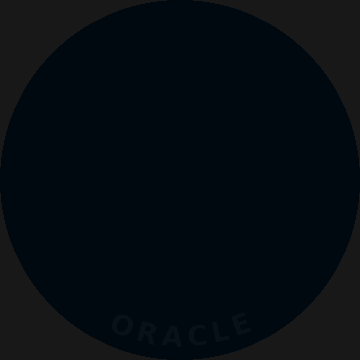
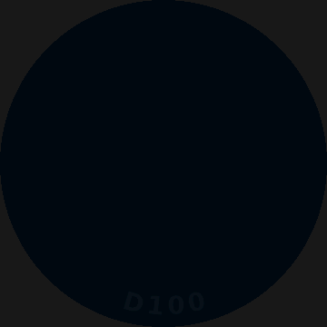
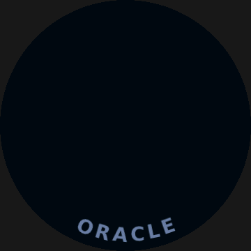

# PYTHIA//

**Handheld Divination Terminal**<br />
Delphi Systems, Oracle Products Division<br />
Owner's Manual, firmware series 0

> Thank you for choosing *PYTHIA//*. Your terminal has been calibrated at the factory to deliver answers with no bias toward any outcome, including the one you were hoping for. Please read this manual before consulting the oracle.

## 1. Overview

*PYTHIA//* is a single-purpose terminal for tabletop play. It rolls dice and it answers yes/no questions. It does nothing else, and it does those two things with hardware-grade randomness that no polyhedral die can match.

The unit ships as a [Waveshare ESP32-S3-Knob-Touch-LCD-1.8](https://www.waveshare.com/esp32-s3-knob-touch-lcd-1.8.htm): a 360x360 round touch display set into a rotary knob, driven by an ESP32-S3 with 16 MB of flash and 8 MB of PSRAM. Rotation and touch are the only controls, and the only ones you will need.

## 2. Installation

Units leave the factory with the vendor's demonstration firmware. Load *PYTHIA//* from a browser; no toolchain is needed.

1. Download `pythia.bin` from the [latest release](https://github.com/stylesuxx/pythia/releases/latest). It is the complete flash image, bootloader included.
2. Open [ESP Launchpad](https://espressif.github.io/esp-launchpad/) in Chrome or Edge. Firefox and Safari lack the Web Serial API it flashes through.
3. Connect the unit by USB-C, choose the **DIY** tab, and click **Connect**. Pick the serial port the browser offers for the ESP32-S3.
4. Click **Add File** and choose `pythia.bin`. **Change the offset field from its prefilled `0x1000` to `0x0`.** The prefilled value is the bootloader address of the original ESP32; on the ESP32-S3 it lands the image 4 KB too high, and the unit reports `invalid image block, can't boot` until it is reflashed.
5. Click **Program**. When the console reports completion, click **Reset Device**. The self-test runs on the first boot.

**CAUTION.** The USB-C port on this chassis reaches one of two processors depending on cable orientation. If the host enumerates a CH340 serial adapter on `/dev/ttyUSB*`, you are connected to the audio co-processor. Unplug the cable, flip it, and reconnect. *PYTHIA//* lives on the ESP32-S3, which enumerates on `/dev/ttyACM*`.

## 3. Operation

On power-up the terminal runs its self-test. After about five seconds the terminal returns to the die it was last set to, armed and waiting for a touch. A new unit arms the oracle. Input during the self-test is discarded.

1. **Turn the knob** to browse the die list. A tick ring around the rim tracks your position.
2. **Hold still for one second.** The selection is confirmed and the display fades to black. The terminal is now armed.
3. **Touch the screen** to roll. A touch while the list is still showing takes the highlighted die and rolls it at once. The result stays on screen until the next touch, which rolls again.
4. **Turn the knob** at any time to return to the list.
5. **Leave the terminal alone for two minutes** and the display goes dark. Touch the screen or turn the knob to bring it back exactly as it was. The touch that wakes it does not roll.

## 4. Examples

Every animation below is rendered by the host preview from the same code the terminal runs, so what you see is what the panel draws, down to RGB565 quantisation.

<table>
<tr>
<td align="center"><br /><b>Self-test</b></td>
<td align="center"><br /><b>Die list</b></td>
</tr>
<tr>
<td align="center"><br /><b>D100 roll</b></td>
<td align="center"><br /><b>Oracle</b></td>
</tr>
</table>

## 5. Divination modes

| Mode | Result |
|---|---|
| D2, D4, D6, D8, D10, D12, D20, D100 | One face, 1 through N |
| D66 | Two independent d6, read as tens and units |
| ORACLE | YES or NO, with an optional AND or BUT |

## 6. Entropy assurance

Delphi Systems does not use pseudo-random sequences in any oracle product.

Every roll draws from the ESP32-S3 hardware random number generator through `esp_random()`. The generator mixes physical noise from the SAR ADC, from the radio when it is running, and from jitter between the free-running 20 MHz RC oscillator and the bus clock. The ADC source is enabled at startup and kept on, so the generator has thermal noise behind it whatever else the firmware is doing. In that state its output passes the NIST SP 800-22 statistical suite.

Each 32-bit draw is XORed with the CPU cycle counter, read at roll time. A roll happens in response to a touch, so the counter carries the moment of the tap at 240 MHz resolution, and the result depends on the operator as well as the silicon. XOR with an independent value preserves the uniformity of the hardware draw.

Faces are chosen by rejection sampling: a draw that falls in the incomplete final window of `2^32 mod sides` is discarded and taken again, so every face of every die is exactly equally likely. D66 rolls two independent d6, and the oracle rolls one d6 against its six outcomes.

## 7. Field service

The firmware is an Arduino project under PlatformIO. Connect the unit by USB-C and run:

```bash
make firmware                    # fetch dependencies, then build
make upload PORT=/dev/ttyACM1
make monitor
make release                     # merge the build into pythia.bin for section 2
```

No third-party source is kept in this repository. `make deps` fetches the ST77916 panel driver and the font rasteriser, each pinned to a version and checked against a recorded hash, and `make firmware` runs it for you.

The cable orientation caution in section 2 applies to `make upload` as well, and so does the second Espressif board problem: pass `PORT` explicitly rather than trusting autodetection.

The animations can be previewed on a workstation without the unit attached, and the test suite runs there too:

```bash
make check                                         # run the test suite
make boot                                          # boot.gif
make menu                                          # menu.gif
make reveal                                        # reveal.gif
make reveal ANSWER=NO MODIFIER=- THEME=parchment
make reveal ANSWER=87 MODIFIER=- CAPTION=D100
```

What it renders is what the panel draws, down to RGB565 quantisation. Each target writes to the repository root by default; the copies in section 4 were written straight into `resources/` by passing `BOOT_GIF`, `MENU_GIF` or `REVEAL_GIF`.

## 8. Notices

*PYTHIA//* is a decision aid. Delphi Systems accepts no liability for characters lost, campaigns derailed, or plans abandoned on the strength of a BUT.
